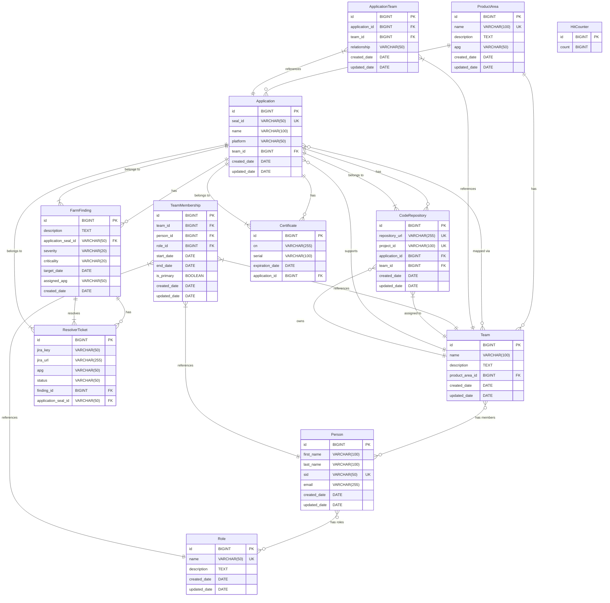

## Overview

This project is a comprehensive Security Dashboard that tracks FARM findings, applications, certificates, resolver tickets, team management, and code repositories. It provides a React-based UI backed by a Spring Boot API with H2 as the data store.

- **Frontend**: React 18 + Vite (dev server at `http://localhost:5173` with proxy to the backend). UI code is modular:
  - `frontend/src/components/FindingsSection.tsx` - Interactive pie charts with filtering
  - `frontend/src/components/ApplicationsSection.tsx` - Application management with findings flyout
  - `frontend/src/components/CertificatesSection.tsx` - Certificate management
  - `frontend/src/components/TicketsSection.tsx` - Global ticket management
  - `frontend/src/components/TeamsSection.tsx` - Team and personnel management
  - `frontend/src/components/CodeRepositoriesSection.tsx` - Code repository management
  - `frontend/src/components/TicketFlyout.tsx` - Ticket management flyout
  - `frontend/src/components/FindingsFlyout.tsx` - Findings display flyout
  - Shared types: `frontend/src/types/domain.ts`
  - API helpers: `frontend/src/services/api.ts`
- **Backend**: Spring Boot 3 (Java 17), Spring Data JPA, H2 database
- **Database**: H2 file on disk (data persisted under `./data/hello.*`)

The dashboard provides comprehensive security management with interactive filtering, team organization, code repository tracking, and detailed management of findings, applications, and their relationships.

## Architecture

- **Backend** (`src/main/java/com/example/hello`)
  - `HelloApplication` — Spring Boot entry point
  - `controllers` — REST controllers (findings, applications, certificates, resolver tickets, teams, product areas, people, roles, code repositories, hello/count)
  - `service` — business logic for all entities
  - `model` — JPA entities: `FarmFinding`, `ResolverTicket`, `Application`, `Certificate`, `HitCounter`, `ProductArea`, `Team`, `Person`, `Role`, `ApplicationTeam`, `TeamMembership`, `CodeRepository`
  - `repository` — Spring Data repositories
  - `DataInitializer` — seeds demo data for all entities
- **Frontend** (`frontend/`)
  - `src/pages/App.tsx` — app shell with tabbed navigation
  - Vite dev proxy forwards `/api`, `/hello`, `/h2-console` to the backend (`vite.config.ts`)
- **Database**
  - Configured in `src/main/resources/application.properties`
  - URL: `jdbc:h2:file:./data/hello;DB_CLOSE_DELAY=-1;AUTO_SERVER=TRUE`
  - H2 console available at `http://localhost:8080/h2-console` (JDBC URL as above, user `sa`, empty password)

## Features

### **Findings Dashboard**
- **Interactive Pie Charts**:
  - "Findings by APG" - click to filter findings by specific APG
  - "Findings by Due Window" - click to filter by due date ranges (Overdue, ≤30 days, 31–60 days, 61–90 days)
  - Dynamic filtering - APG filter affects due window chart counts
  - "Show All" buttons to clear filters
- **Current Findings Table**: ID, Description, Application Seal ID, Severity/Criticality, Assigned APG, Resolver Ticket(s), Created date
- **Excel Export/Import**: Bulk operations for findings data
- **Filtered Views**: Clear indicators when filters are active

### **Applications Management**
- **Applications Table**: App Name, Platform, Assigned Team, APG (derived from team), Code Repository, Certificates, Farm Findings count
- **Interactive Findings Count**: Click to open findings flyout for that application
- **CRUD Operations**: Create/Edit/Delete applications with team assignment
- **Findings Flyout**: Dedicated component showing all findings for selected application with ticket management

### **Certificates Management**
- **Certificates Table**: CN, Serial, Expiration Date, Application
- **CRUD Operations**: Create, edit, delete certificates
- **Application Association**: Link certificates to applications
- **Dedicated Tab**: Separate management interface

### **Resolver Tickets**
- **Global Tickets View**: All tickets across all findings
- **Ticket Management Flyout**: Add/remove tickets for specific findings
- **Excel Export/Import**: Bulk operations for ticket data
- **Real-time Updates**: Changes reflect immediately across all views

### **Teams Management**
- **Product Areas**: Organizational units for applications with APG designation
- **Teams**: Support teams within product areas
- **People**: Individual team members with SID (Security ID)
- **Roles**: Team member roles (e.g., Developer, Lead, Manager)
- **Application-Team Relationships**: Link applications to support teams
- **Team Memberships**: Track who is on which team with what role
- **Comprehensive CRUD**: Full management of all team entities
- **Form Management**: Proper form state handling with tab switching

### **Code Repositories Management** (NEW)
- **Code Repositories Table**: Repository URL, Project ID, Application Name, Assigned Team
- **CRUD Operations**: Create, edit, delete code repositories
- **Application Association**: Link repositories to applications
- **Team Assignment**: Assign repositories to support teams
- **Excel Export/Import**: Bulk operations for repository data
- **Dedicated Tab**: Separate management interface

### **Interactive Features**
- **Pie Chart Filtering**: Click charts to filter data, see "Show All" buttons
- **Flyout Components**: Dedicated overlays for detailed management
- **Real-time Updates**: Changes propagate across all views
- **Excel Integration**: Export and import for bulk operations
- **Responsive Design**: Modern UI with consistent styling
- **Form State Management**: Proper form handling with tab switching

## Quick start

- **Prerequisites**
  - Java 17+
  - Node.js 18+ (Node 20 recommended)
  - Maven (or run from IDE)

- **Start backend (dev)**
  - Using IDE: run `com.example.hello.HelloApplication`
  - Using Maven: `mvn spring-boot:run`

- **Start frontend (dev)**
  - `cd frontend`
  - `npm install`
  - `npm run dev`
  - Open `http://localhost:5173` (requests to `/api` proxy to `http://localhost:8080`)

- **Build full app (backend + frontend)**
  - `mvn clean package`
  - This builds frontend assets and copies them to backend `static/`, producing an executable JAR
  - Run the app: `java -jar target/hello-0.0.1-SNAPSHOT.jar`

## Configuration

`src/main/resources/application.properties`:

```properties
spring.application.name=hello
spring.h2.console.enabled=true
spring.datasource.url=jdbc:h2:file:./data/hello;DB_CLOSE_DELAY=-1;AUTO_SERVER=TRUE
spring.datasource.driverClassName=org.h2.Driver
spring.datasource.username=sa
spring.datasource.password=
spring.jpa.hibernate.ddl-auto=update
spring.web.resources.add-mappings=true
```

## Data Model

### Core Entities

#### Application
```json
{
  "id": 1,
  "sealId": "APP-00001",      // unique link key
  "name": "Customer Portal",
  "platform": "Web",
  "team": { "id": 1, "name": "Customer Portal Team" },
  "productArea": { "id": 1, "name": "Customer Experience", "apg": "Relationships" }
}
```

#### FarmFinding
```json
{
  "id": 42,
  "description": "Sample finding #42 for Identity",
  "applicationSealId": "APP-00002",   // links to Application.sealId
  "severity": "High",
  "criticality": "Medium",
  "targetDate": "2025-03-01",
  "assignedApg": "Identity",
  "createdDate": "2025-01-15T10:30:00"
}
```

#### ResolverTicket
```json
{
  "id": 10,
  "jiraKey": "SEC-123",
  "jiraUrl": "https://jira.example.com/browse/SEC-123",
  "apg": "Identity",
  "status": "In Progress",
  "finding": { "id": 42 }
}
```

#### Certificate
```json
{
  "id": 7,
  "cn": "customer.example.com",
  "serial": "01A3-FFFF-1111",
  "expirationDate": "2026-01-01",
  "application": { "id": 1 }
}
```

#### CodeRepository (NEW)
```json
{
  "id": 1,
  "repositoryUrl": "https://git.example.com/customer-portal",
  "projectId": "CUST-PORTAL-001",
  "application": { "id": 1, "name": "Customer Portal" },
  "team": { "id": 1, "name": "Customer Portal Team" },
  "createdDate": "2025-01-01T00:00:00",
  "updatedDate": "2025-01-01T00:00:00"
}
```

### Team Management Entities

#### ProductArea
```json
{
  "id": 1,
  "name": "Customer Experience",
  "description": "Customer-facing applications and services",
  "apg": "Relationships",
  "createdDate": "2025-01-01T00:00:00",
  "updatedDate": "2025-01-01T00:00:00"
}
```

#### Team
```json
{
  "id": 1,
  "name": "Customer Portal Team",
  "description": "Maintains customer portal applications",
  "productArea": { "id": 1, "name": "Customer Experience", "apg": "Relationships" },
  "createdDate": "2025-01-01T00:00:00",
  "updatedDate": "2025-01-01T00:00:00"
}
```

#### Person
```json
{
  "id": 1,
  "firstName": "John",
  "lastName": "Doe",
  "sid": "JDOE123",           // unique Security ID
  "email": "john.doe@example.com",
  "createdDate": "2025-01-01T00:00:00",
  "updatedDate": "2025-01-01T00:00:00"
}
```

#### Role
```json
{
  "id": 1,
  "name": "Developer",        // unique role name
  "description": "Software developer role",
  "createdDate": "2025-01-01T00:00:00",
  "updatedDate": "2025-01-01T00:00:00"
}
```

#### ApplicationTeam (Many-to-Many)
```json
{
  "id": 1,
  "application": { "id": 1, "name": "Customer Portal" },
  "team": { "id": 1, "name": "Customer Portal Team" },
  "relationship": "Primary Support",
  "createdDate": "2025-01-01T00:00:00",
  "updatedDate": "2025-01-01T00:00:00"
}
```

#### TeamMembership (Many-to-Many-to-Many)
```json
{
  "id": 1,
  "team": { "id": 1, "name": "Customer Portal Team" },
  "person": { "id": 1, "firstName": "John", "lastName": "Doe" },
  "role": { "id": 1, "name": "Developer" },
  "startDate": "2025-01-01",
  "endDate": null,
  "isPrimary": true,
  "createdDate": "2025-01-01T00:00:00",
  "updatedDate": "2025-01-01T00:00:00"
}
```

## ER Diagram

The following Mermaid diagram shows the complete entity relationships in the Security Dashboard:



### Key Relationships:

- **ProductArea** → **Team**: One product area can have multiple teams
- **ProductArea** → **Application**: One product area can have multiple applications (via team)
- **Team** → **Application**: Teams support applications (many-to-many via ApplicationTeam)
- **Team** → **Person**: Teams have members (many-to-many-to-many via TeamMembership)
- **Application** → **FarmFinding**: Applications can have multiple security findings
- **Application** → **Certificate**: Applications can have multiple certificates
- **Application** → **CodeRepository**: Applications can have multiple code repositories
- **FarmFinding** → **ResolverTicket**: Findings can have multiple resolver tickets
- **Team** → **CodeRepository**: Teams can own multiple code repositories

The diagram shows the complete data model with all entities and their relationships, including the new CodeRepository entity and the updated team-based application assignment structure.

## REST APIs

Base URL: `http://localhost:8080`

### Applications

- `GET /api/applications` — list all
- `GET /api/applications/{id}` — get by ID
- `POST /api/applications` — create
- `PUT /api/applications/{id}` — update
- `DELETE /api/applications/{id}` — delete

### FARM findings

- `GET /api/findings` — list findings
- `GET /api/findings/summary/apg` — summary counts of findings by APG
- `POST /api/findings` — create finding
- `PUT /api/findings/{id}` — update finding
- `DELETE /api/findings/{id}` — delete finding

Excel:
- `GET /api/findings/export` — download findings.xlsx
- `POST /api/findings/import` — upload findings.xlsx to bulk upsert

### Resolver tickets (nested under a finding)

- `GET /api/findings/{findingId}/tickets` — list tickets for a finding
- `POST /api/findings/{findingId}/tickets` — add a ticket
- `PUT /api/findings/{findingId}/tickets/{ticketId}` — update a ticket
- `DELETE /api/findings/{findingId}/tickets/{ticketId}` — delete a ticket

### Resolver tickets (global)

- `GET /api/tickets` — list all resolver tickets
- `GET /api/tickets/export` — download resolver_tickets.xlsx
- `POST /api/tickets/import` — upload resolver_tickets.xlsx

### Certificates

- `GET /api/certificates` — list all certificates
- `GET /api/certificates/application/{applicationId}` — list certificates for an application
- `POST /api/certificates/application/{applicationId}` — create and associate a certificate
- `PUT /api/certificates/{id}` — update a certificate
- `DELETE /api/certificates/{id}` — delete a certificate

### Code Repositories (NEW)

- `GET /api/code-repositories` — list all code repositories
- `GET /api/code-repositories/{id}` — get by ID
- `POST /api/code-repositories` — create
- `PUT /api/code-repositories/{id}` — update
- `DELETE /api/code-repositories/{id}` — delete

Excel:
- `GET /api/code-repositories/export` — download code-repositories.xlsx
- `POST /api/code-repositories/import` — upload code-repositories.xlsx

### Team Management APIs

#### Product Areas
- `GET /api/product-areas` — list all
- `GET /api/product-areas/{id}` — get by ID
- `POST /api/product-areas` — create
- `PUT /api/product-areas/{id}` — update
- `DELETE /api/product-areas/{id}` — delete

#### Teams
- `GET /api/teams` — list all
- `GET /api/teams/{id}` — get by ID
- `GET /api/teams/product-area/{productAreaId}` — list by product area
- `POST /api/teams` — create
- `PUT /api/teams/{id}` — update
- `DELETE /api/teams/{id}` — delete

#### People
- `GET /api/people` — list all
- `GET /api/people/{id}` — get by ID
- `GET /api/people/sid/{sid}` — get by SID
- `POST /api/people` — create
- `PUT /api/people/{id}` — update
- `DELETE /api/people/{id}` — delete

#### Roles
- `GET /api/roles` — list all
- `GET /api/roles/{id}` — get by ID
- `POST /api/roles` — create
- `PUT /api/roles/{id}` — update
- `DELETE /api/roles/{id}` — delete

#### Application Teams
- `GET /api/application-teams` — list all
- `GET /api/application-teams/{id}` — get by ID
- `GET /api/application-teams/application/{applicationId}` — list by application
- `GET /api/application-teams/team/{teamId}` — list by team
- `POST /api/application-teams` — create
- `PUT /api/application-teams/{id}` — update
- `DELETE /api/application-teams/{id}` — delete

#### Team Memberships
- `GET /api/team-memberships` — list all
- `GET /api/team-memberships/{id}` — get by ID
- `GET /api/team-memberships/team/{teamId}` — list by team
- `GET /api/team-memberships/person/{personId}` — list by person
- `POST /api/team-memberships` — create
- `PUT /api/team-memberships/{id}` — update
- `DELETE /api/team-memberships/{id}` — delete

### Utility

- `GET /hello` — returns greeting and increments a hit counter
- `GET /api/count` — returns current hit count

### OpenAPI / Swagger

- Swagger UI: `http://localhost:8080/swagger-ui/index.html`
- OpenAPI docs JSON: `http://localhost:8080/v3/api-docs`

## CORS

Controllers enable CORS for the Vite dev server origin:

- Allowed origin: `http://localhost:5173`

## Seeding

`DataInitializer` seeds comprehensive demo data:

- **Applications**: 3 sample applications with different platforms and team assignments
- **FARM Findings**: Up to 50 findings distributed across APGs with randomized severity/criticality/target dates
- **Certificates**: Sample certificates for seeded applications
- **Code Repositories**: 3 sample repositories linked to applications and teams
- **Product Areas**: 3 organizational units (Customer Experience, Identity & Security, Data & Analytics) with APG designations
- **Teams**: 6 teams across the product areas
- **People**: 12 team members with unique SIDs
- **Roles**: 4 roles (Developer, Lead, Manager, Architect)
- **Application Teams**: Relationships between applications and support teams
- **Team Memberships**: Team member assignments with roles and primary indicators

## Interactive Features

### Pie Chart Filtering
- **APG Chart**: Click any slice to filter findings by that APG
- **Due Window Chart**: Click any slice to filter by due date range
- **Dynamic Updates**: APG filter affects due window chart counts
- **Combined Filtering**: Can filter by both APG and due window simultaneously
- **Visual Feedback**: Charts show filter status and "Show All" buttons

### Flyout Components
- **Findings Flyout**: Click application findings count to see all findings for that application
- **Ticket Flyout**: Manage tickets for specific findings with add/delete functionality
- **Real-time Updates**: Changes in flyouts reflect immediately across all views

### Excel Integration
- **Export**: Download current data as Excel files
- **Import**: Bulk upload data from Excel files
- **Supported**: Findings, Tickets, Code Repositories, and all team management entities

### Form Management
- **Tab Switching**: Forms properly close when switching between tabs
- **State Management**: Form state is reset appropriately
- **Validation**: Required fields and proper error handling
- **Real-time Updates**: Changes reflect immediately across all views

## Development notes

- The Vite dev server proxies `/api`, `/hello`, and `/h2-console` to `http://localhost:8080` (see `frontend/vite.config.ts`).
- On `mvn package`, the frontend is built and copied into the backend `static/` so the Spring Boot JAR serves the UI directly.
- All components are modular and reusable with clear separation of concerns.
- The application supports comprehensive team management with full CRUD operations.
- Interactive filtering provides powerful data exploration capabilities.
- Code repository management provides complete tracking of development repositories.
- Form state management ensures proper user experience across all tabs.


